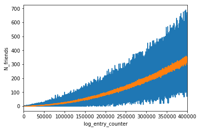
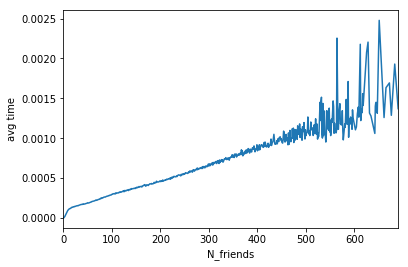
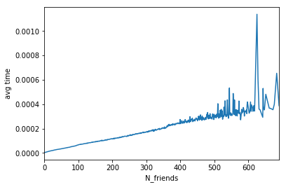

Table of Contents
=================

  * [Summary of files](#summary-of-files)
  * [Dependencies](#dependencies)
  * [Run instruction](#run-instruction)
  * [Approach](#approach)
    * [UserNetwork class constructor](#usernetwork-class-constructor)
    * [UserNetwork class methods](#usernetwork-class-methods)
    * [Complexity](#complexity)

# Summary of files
* [src/process_log.py](src/process_log.py): all the source code for this project
* [src/analyze_complexity.ipynb](src/analyze_complexity.ipynb): jupyter notebook for investigating algorithm complexity

Other files and overall folder structure follow the guidelines here at [README_original.md](README_original.md) (read this first for background)

Test results before submission in [final_test_log.txt](final_test_log.txt)


# Dependencies
The program is tested in python 2.7.13. The following packages are required.

1. sys: for command line argument parsing 
2. json: for log entry parsing into dictionaries
3. math: for calculation of standard deviation
4. heapq: for sorting algorithm using a priority queue
5. tqdm: for progress bar print out
6. pickle: for serializing data in debug mode
7. time: for recording run time in debug mode

# Run instruction
sh run.sh


# Approach

## UserNetwork class constructor

The user network is implemented in one class UserNetwork. In the constructor we have:

1. **D**: specifies Dth degree connections to be included in user's network
2. **T**: specifies T recent purchases in network to be considered for anomaly detection
3. **log_entry_counter**: assign a unique id for each log entry processed as a proxy for unique timestamp
4. **network**: a dictionary stores user network, key is user_id, value is the set user's 1st degree connections
5. **own_purchases**: a dictionary stores the purchase history of individual users, key is user_id, value is a list of 2-item lists in the format \[log_entry_counter, purchase amount]
6. **flagged_purchases**: a list stores flagged anomalous purchases, each item is a string in specified format, with mean and sd fields
7. **do_flag_purchases**: bool, specifies whether to flag anomalous purchase; when building initial network from batch_log, this is set to False
8. a few utility parameters for debug mode

        # specifies if in debug mode, only populate the logs below in debug mode
        self.debug_mode = debug_mode

        # some useful debug info for studying complexity
        self.n_friends_log = []  # records # of connected users vs log_entry_counter
        self.n_items_to_merge_log = []  # records total # of items in all relevant purchase history lists
        self.find_friends_time_log = []  # records the time spent on building social circles
        self.merge_time_log = []  # records the time spent on heap merge

## UserNetwork class methods
The UserNetwork class has the following methods:

1. **process_log_entry()**

    It processes incoming log entry one line at a time as a dictionary entry_dict. It first checks log entry validity, if not valid then skip it. 
    For valid entries, it decides whether it is a purchase, befriend or unfriend activity and calls appropriate functions

2. **add_user_if_new()**

    Helper function for checking if user exists, otherwise initialize user in self.network and self.own_purchases 
    
3. **add_connection()**

    Function to handle befriend activities.
    
4. **remove_connection()**

    Function to handle unfriend activities.
    
5. **add_purchase()**

    Function to handle purchase entries
    
    The key steps are: 
    * add user if new
    * append purchage to user's own purchase history
    * if self.do_flag_purchases == True, meaning we need to flag anomaly purchases:
        1. find all the friends in user's D-th network (calls **find_friends()**, see below)
        2. get the purchase histories of each friend (already sorted by log_entry_counter)
        3. merge friends' purchase histories while maintaining sorted order, get the latest T entries
        4. calculated mean and sd and determine if current purchase is anomalous, 
        if anomalous then record flagged purchase in specified format (calls **flag_purchase()**, see below)
        
6. **find_friends()**

    Function to find all the friends in user's Dth degree network; this is a non recursive implementation of breadth first search

7. **flag_purchase()**

    Flag anomalous purchase given recent purchase history from network and purchase amount of current purchase
    
8. **debug_log()**

    Output a few logs for debugging purposes, mainly for verifying program's complexity
    
## Complexity

Compared to add_connection() and remove_connection(), add_purchase() is far more time consuming due to the need to find friends 
(step a under **add_purchase()**) 
as well as to merge and sort relevant purchase histories from all the friends (step b~c under **add_purchase()**).
In addition, based on batch_log in the medium size sample dataset, purchase entries account for more than 80% of all the log entries.
So we should definitely focus on building a efficient add_purchase() function.

For step a, we have ```O(N)``` complexity, where N is the number of friends the user has within Dth degree network.

For step b~c, we should take advantage of the fact that each user's own purchase history is already sorted. If we neglect this fact and directly sort
N lists, each has M elements into a big lists, we would have ```O(N*M*log(N*M))``` time complexity. 
Instead, I used a heap to keep track of the most recent items of each list, at most I need T heappop() calls each has ```O(log(N))``` complexity, 
and T heappush() calls each has ```O(log(N))``` complexity. For selecting next latest item in each individual purchase history, we just need to move along the
list that is already sorted, so it is ```O(1)``` complexity. In addition, I need to build a heap, ```O(N)``` complexity. 
Overall, we have ```O(N)``` complexity. 

A useful test of complexity would be to turn on the do_flag_purchases flag while parsing through the batch_log file in the medium size sample dataset. 
There are 500,000 entries total, resulting in about 10,000 users.

Note: the following plots (and some more) are generated by [src/analyze_complexity.ipynb](src/analyze_complexity.ipynb).

First of all, we can look at how N_friends (the number of friends in user's network) changes over time as we go through this long log.



(Note: blue line is the raw recorded data points, orange line is median value over a window of 100 log entries)

It is interesting to note that as we add more log entries, the number of users is probably linearly increasing, and we see a quandratic increase
in the number of connections a user has, which makes sense.

Now we can plot the runtime for step a vs N_friends



Then, runtime for step b~c vs N_friends



Indeed both scales linearly with N_friends, except for the very end where a small number of recording resulted in large variance.


